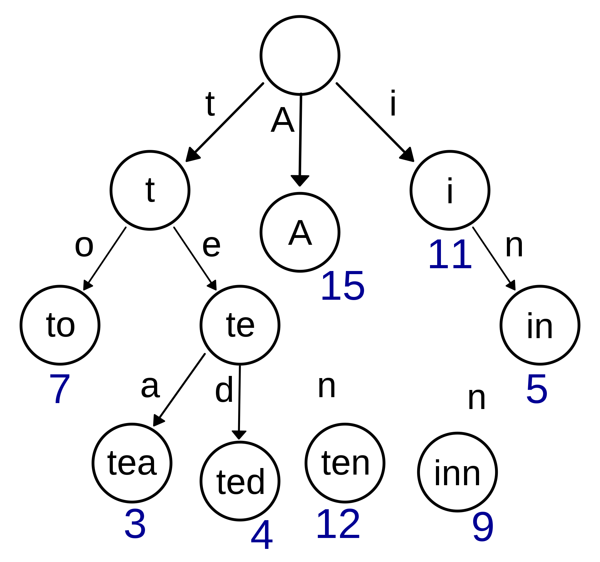

# TRIE

## Thoery

In computer science, a trie, also called digital tree or prefix tree, is a type of search tree, a tree data structure used for locating specific keys from within a set. These keys are most often strings, with links between nodes defined not by the entire key, but by individual characters. In order to access a key (to recover its value, change it, or remove it), the trie is traversed depth-first, following the links between nodes, which represent each character in the key. [Wikipedia](https://en.wikipedia.org/wiki/Trie)



In the figure above, we have strings: “to”, “tea”, “ted”, “ten”, “A”, “i”, “in”, “inn”. The numbers associated with the string are the values associated to “string keys”

To search for the string in the tree, we can simply start from the empty string and traverse tree by:
Taking index (starting with 0, first character) of string and matching it with the key (child) of the current node.
Open up that child (key) and access its nodes and continue this process until we exhaust the tree. It is a recursive process.


## Example

Code has been copied from this [Medium Blog](https://medium.com/@zeeshan_hyder/lets-trie-with-javascript-70642c605ecd)

Please read the blog for more details or read `index.ts` , methods are commented.

run the example with 
```
cd digital-tree
npm start
```
the last line of `index.ts` prints all the trie , which contains (ex, elaps,exist,exit,exibit,exhodus)

the following will be printed on the console:

```
-> 1.1 e
        -> 2.1 el
                -> 3.1 ela
                        -> 4.1 elap
                                -> 5.1 elaps
        -> 2.2 ex
                -> 3.1 exi
                        -> 4.1 exis
                                -> 5.1 exist
                        -> 4.2 exit
                        -> 4.3 exib
                                -> 5.1 exibi
                                        -> 6.1 exibit
                -> 3.2 exa
                -> 3.3 exh
                        -> 4.1 exho
                                -> 5.1 exhod
                                        -> 6.1 exhodu
                                                -> 7.1 exhodus
```